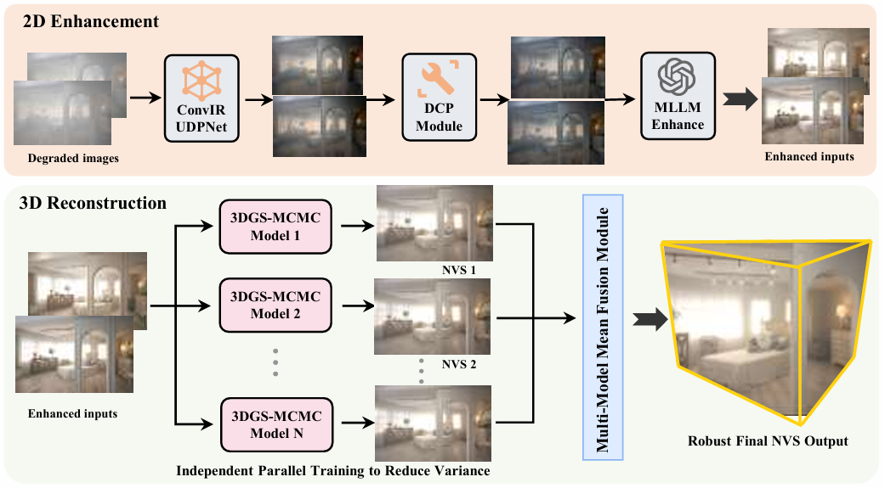

<div align="center">

# 🚀 GenSmoke-GS

🔥 **Results and code released. Gaussian weights (1–20 runs) are now available.**

</div>

---

## 📌 Overview

**GenSmoke-GS** is a reconstruction-oriented multi-stage pipeline designed to improve **3D reconstruction under smoke-degraded multi-view conditions**.

It consists of two main modules:

* 🔧 **2D Enhancement**: UDPNet restoration → DCP dehazing → MLLM enhancement
* 🧱 **3D Reconstruction**: 3DGS-MCMC training → multi-run fusion

---

## 🖼️ Method Pipeline

<div align="center">

</div>

---

## 🔄 Pipeline Summary

```text
Haze Images
   ↓
UDPNet Restoration
   ↓
DCP Dehazing
   ↓
MLLM Enhancement
   ↓
3DGS-MCMC Reconstruction (91 runs)
   ↓
Multi-run Averaging
   ↓
Final NVS Results
```

---

## 📂 Repository Structure

```bash
2d_enhancement/     # UDPNet + DCP + MLLM enhancement
3d_reconstruction/  # 3DGS-MCMC + FasterGS + fusion
pip.png
README.md
```

---

## 🚀 Quick Start

### 1️⃣ 2D Enhancement (UDPNet + DCP)

```bash
cd 2d_enhancement

pip install -r requirements.txt
pip install -r dcp_dehaze/requirements.txt

python run_udp_then_dcp.py \
  --scene_roots <input_dataset_dirs> \
  --out_root <output_dir> \
  --ckpt code/UDPNet/UDPNet_checkpoints/ConvIR_UDPNet_ITS.ckpt
```

---

### 📦 External Dependencies & Weights

This module relies on several external methods.

* **UDPNet (ConvIR + UDPNet)**
  🔗 https://github.com/Harbinzzy/UDPNet

* **DepthAnything V2**
  🔗 https://github.com/DepthAnything/Depth-Anything-V2

* **Dark Channel Prior (DCP)**
  🔗 https://github.com/joyeecheung/dark-channel-prior-dehazing

---

### 📊 Our Released Results (After UDPNet + DCP)

* 🔗 UDPNet outputs:
  https://pan.baidu.com/s/1Ea5j3WNVK3vdZU8eVMRcAg

* 🔗 DCP dehazed results:
  https://pan.baidu.com/s/1IDokNAZgEUQw1S2c8iXbFw

---

## 🧠 MLLM Enhancement (GPT-Image-1.5)

This stage performs view-wise enhancement using the OpenAI image generation API.

---

### 🔧 Model

* Model: **`gpt-image-1.5`**
* Docs: https://platform.openai.com/docs/guides/image-generation

---

### 📄 Prompt

* Default prompt:
  [`gpt_image_prompt_default.txt`](gpt_image_prompt_default.txt)

---

### 📊 Our Released Results (MLLM Outputs)

* 🔗 https://pan.baidu.com/s/1M14Tw5RY42ovroslUz0PWA

---

## 🧱 3️⃣ 3D Reconstruction

```bash
cd 3d_reconstruction

bash install.sh
sudo apt install -y colmap

./train.sh /path/to/dataset_parent
```

---

### 📊 Our Released Results (3D Reconstruction)

* 🔗 Final NVS results:
  https://pan.baidu.com/s/1pW--LhgjuKOiCylqCLJcaQ

* 🔗 Multi-run results (91 runs):
  https://pan.baidu.com/s/1roCxrpJEd8pTqFOMCbMlyQ

---

### 🧠 Gaussian Weights (Released)

We additionally provide trained Gaussian splatting weights from **runs 1–20**:

* 🔗 https://pan.baidu.com/s/12P0-5X9deoqdl-TMe1fY2g?pwd=plbb

📌 Notes:

* These weights are obtained from **20 independent runs**
* The performance is **comparable to the full 91-run averaging results**
* Useful for:

  * faster evaluation
  * lightweight reproduction
  * ablation studies

---

## 📁 Dataset

* 🔗 https://pan.baidu.com/s/1IoIEuE9XTFhEb4meOYp3_g?pwd=plbb

---

## 🚧 Release Plan

### ✅ 2026-03-25

* [x] Results released

### ✅ 2026-03-26

* [x] Code released

### ✅ 2026-03-27

* [x] Gaussian weights (partial) released

---

## 📦 TODO

* [x] Upload results
* [x] Upload code
* [x] Upload Gaussian weights (1–20 runs)
---

## 📬 Contact

If you have any questions:

* Open an **Issue**
* Contact the authors

---
